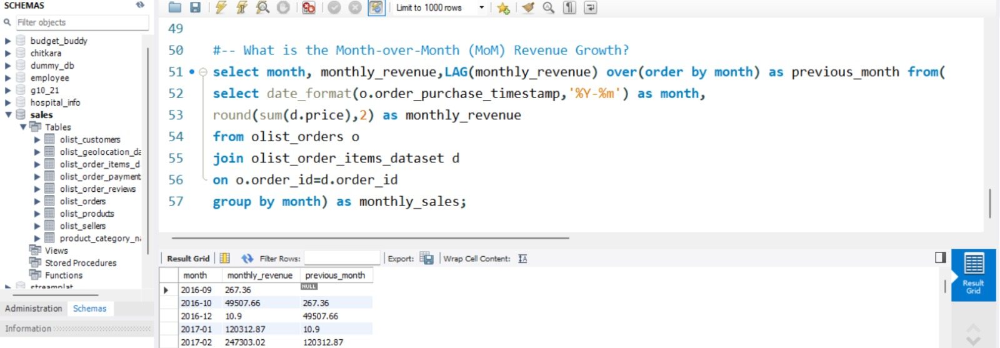
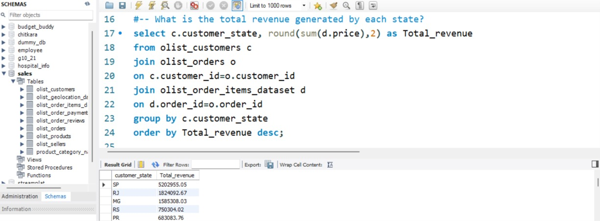
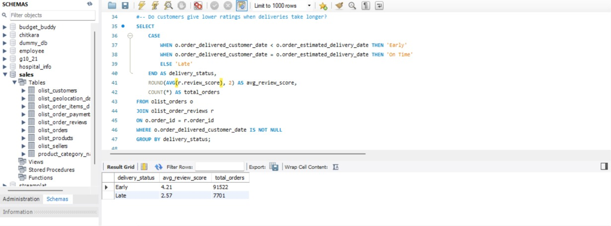

<div align="center">

# 🛒 End-to-End E-commerce Analytics

### SQL • Python • Power BI • Machine Learning

An end-to-end Data Analytics project on the Brazilian Olist E-commerce dataset, covering SQL analysis, Exploratory Data Analysis (EDA), interactive Power BI dashboards, and Machine Learning.

---


</div>

---

# 📌 Project Overview

This project analyzes the **Brazilian Olist E-commerce Dataset** to answer real-world business questions using SQL, perform data cleaning and analysis using Python, build interactive Power BI dashboards, and develop predictive Machine Learning models.

The objective is to demonstrate an end-to-end analytics workflow used by Data Analysts and Data Scientists.

---

# 🚀 Project Workflow

```text
Raw Dataset
      │
      ▼
SQL Analysis
      │
      ▼
Exploratory Data Analysis
      │
      ▼
Data Cleaning
      │
      ▼
Feature Engineering
      │
      ▼
Power BI Dashboard
      │
      ▼
Machine Learning
      │
      ▼
Business Insights
```

---

# 🛠 Tech Stack

| Category | Tools |
|----------|-------|
| Database | MySQL |
| Language | SQL, Python |
| Libraries | Pandas, NumPy, Matplotlib, Scikit-learn |
| Visualization | Power BI |
| Version Control | Git, GitHub |

---

# 📂 Dataset

**Dataset Name**

Brazilian E-commerce Public Dataset by Olist

🔗 https://www.kaggle.com/datasets/olistbr/brazilian-ecommerce

---

# 🗂 Database Tables

- Customers
- Orders
- Order Items
- Products
- Payments
- Reviews
- Sellers
- Category Translation

---

# 📊 SQL Analysis

This section answers real-world business questions using SQL on the Brazilian Olist E-commerce dataset. The analysis covers customer behavior, sales performance, product trends, delivery performance, customer reviews, and advanced analytical queries using window functions.

---

## 👥 Customer Analysis

### Business Questions Solved

- Total Customers
- Customers by State
- Repeat Customers
- Top 10 Customers by Spending
- Top 5 Customers by Spending in Each State (Window Function)

### 🔍 SQL Concepts Used

- SELECT
- WHERE
- GROUP BY
- HAVING
- ORDER BY
- JOIN
- Aggregate Functions
- Window Functions (DENSE_RANK())

### 📸 SQL Showcase

<p align="center">
    
</p>

### 💡 Business Insight

This analysis identifies the highest-value customers in each state using **DENSE_RANK()**, helping businesses design targeted marketing campaigns, loyalty programs, and customer retention strategies.

---

## 💰 Sales Analysis

### Business Questions Solved

- Total Revenue
- Revenue by Month
- Revenue by State
- Revenue by Category
- Revenue by Seller
- Average Order Value
- Month-over-Month Revenue Analysis

### 🔍 SQL Concepts Used

- JOIN
- GROUP BY
- Aggregate Functions
- DATE_FORMAT()
- Window Functions (`LAG()`)

### 📸 SQL Showcase

<p align="center">
    
</p>

### 💡 Business Insight

Sales analysis provides insights into revenue trends, top-performing states, sellers, and product categories. Month-over-month analysis helps identify seasonal trends and business growth patterns.

---

## 📦 Product Analysis

### Business Questions Solved

- Most Expensive Products
- Highest Freight Cost
- Top Selling Products
- Product Categories

### 🔍 SQL Concepts Used

- ORDER BY
- LIMIT
- Aggregate Functions
- JOIN

### 💡 Business Insight

Product analysis helps identify premium products, logistics costs, and top-performing product categories, enabling better inventory and pricing decisions.

---

## 🚚 Delivery Analysis

### Business Questions Solved

- Average Delivery Time
- Delivery Time by State
- Delivery Time by Seller
- Late Deliveries
- Early Deliveries

### 🔍 SQL Concepts Used

- DATEDIFF()
- JOIN
- GROUP BY
- Aggregate Functions

### 💡 Business Insight

Delivery performance analysis highlights operational efficiency across sellers and regions, helping improve customer satisfaction and reduce delivery delays.

---

## ⭐ Review Analysis

### Business Questions Solved

- Review Score Distribution
- Lowest Rated Categories
- Delivery Time vs Review Score

### 🔍 SQL Concepts Used

- JOIN
- GROUP BY
- AVG()
- ORDER BY

### 📸 SQL Showcase

<p align="center">
    
</p>

### 💡 Business Insight

Review analysis identifies low-performing product categories and examines the relationship between delivery performance and customer satisfaction, enabling data-driven quality improvements.

---

## 🚀 Advanced SQL Techniques

This project also demonstrates advanced SQL concepts including:

- Window Functions (DENSE_RANK, LAG)
- Common Table Expressions (CTEs)
- Nested Queries
- Aggregate Functions
- Multi-table JOINs
- Date Functions
- Ranking Functions
- Analytical Queries

---

### 📈 Key SQL Skills Demonstrated

- ✔ Complex JOIN Operations
- ✔ Business Problem Solving
- ✔ Data Aggregation
- ✔ Window Functions
- ✔ Ranking Functions
- ✔ Time-Series Analysis
- ✔ Customer Analytics
- ✔ Sales Analytics
- ✔ Product Analytics
- ✔ Delivery Analytics
- ✔ Review Analytics

# 📊 Exploratory Data Analysis

✔ Missing Value Analysis

✔ Duplicate Detection

✔ Outlier Detection

✔ Univariate Analysis

✔ Bivariate Analysis

✔ Correlation Analysis

✔ Feature Engineering

---

# 📈 Power BI Dashboard

Dashboard includes:

- Revenue KPIs
- Monthly Revenue Trend
- Sales by State
- Seller Performance
- Delivery Performance
- Customer Insights

---

# 🤖 Machine Learning

This project will include:

- Data Preprocessing
- Feature Engineering
- Model Building
- Hyperparameter Tuning
- Model Evaluation
- Model Comparison

Possible models:

- Delivery Time Prediction
- Review Score Prediction
- Customer Segmentation

---

# 📁 Project Structure

```
End-to-End-Ecommerce-Analytics

│── README.md

├── Dataset

├── SQL
│      ├── 01_database_setup.sql
│      ├── 02_basic_queries.sql
│      ├── 03_intermediate_queries.sql
│      └── 04_advanced_queries.sql

├── EDA
│      ├── Ecommerce_EDA.ipynb
│      └── images

├── PowerBI
│      ├── Ecommerce_Dashboard.pbix
│      ├── dashboard.pdf
│      └── dashboard.png

├── Machine_Learning
│      ├── preprocessing.ipynb
│      ├── model_building.ipynb
│      ├── evaluation.ipynb
│      └── saved_model.pkl

└── Images
```

---

# 📸 Project Screenshots

## SQL

<p align="center">

</p>

---

## Power BI Dashboard

<p align="center">

</p>

---

## Machine Learning

<p align="center">

</p>

---

# 📌 Key Business Insights

- Identified top-performing states by revenue.
- Analyzed seller performance across regions.
- Evaluated delivery efficiency.
- Investigated customer satisfaction using review scores.
- Measured monthly business growth.
- Ranked sellers and customers using window functions.

---

# 🎯 Future Enhancements

- Deploy ML model using Streamlit
- Build interactive dashboards
- Add forecasting models
- Automate ETL pipeline

---

# 👩‍💻 Author

**Ishika Mangla**

Aspiring Data Analyst | SQL | Python | Power BI | Machine Learning

Connect with me on LinkedIn!

⭐ If you found this project useful, consider giving it a star!
